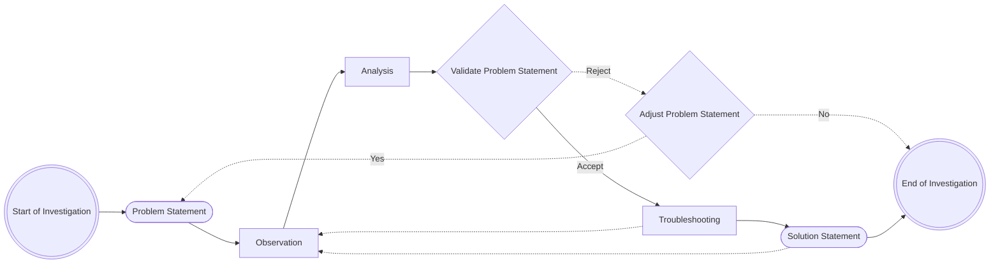

# Overview

[**investigation**](https://github.com/swanson8r/investigation) is a repository of [sre troubleshooting](https://sre.google/sre-book/effective-troubleshooting/) artifacts created for use with [Datadog](https://docs.datadoghq.com/service_management/case_management/) as the observability platform.

## Operational Flowchart

[Mermaid Diagram](https://docs.github.com/en/get-started/writing-on-github/working-with-advanced-formatting/creating-diagrams#creating-mermaid-diagrams) of steps in the investigation process

# Folders and Contents

## Status

The root of this repo contains the following folders by status with one subfolder per investigation

### Active

Ongoing investigation artifacts

### Archived

Contains completed or abandoned investigation folders with artifacts retained for future reference

## Investigation

Each investigation folder contains artifacts by process step

### Problem Statement

This is a Markdown document in the investigation folder. It contains an initial short statement requiring investigation.

> [!NOTE]
> Each Problem Statement arrives to SRE with inherent assumptions and bias

### Observations

Objective data that can be used to perform Analysis
- screenshots
- logs
- metrics
- traces
- events

### Analysis

Opinionated correlation of Observations to perform Validation of the Problem Statement

- written documentation
- advanced notebooks

### Troubleshooting

Active steps to mitigate Validated Observations

- scripts
- configs

### Solution Statement

This is an update to the [Problem Statement](./#problem-statement) document once an investigation has been completed. 
Solution Statements should only appear in [archived](./#archived) investigation folders.
