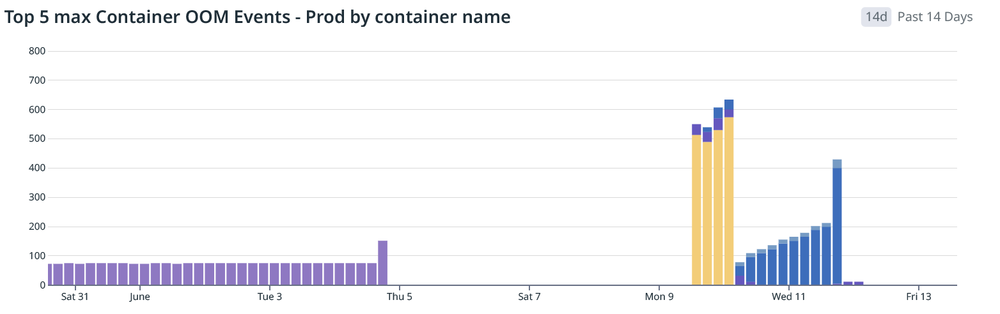

# datadog-agent OOMKilled CrashLoopBackOff

## Notebook

- Container: Memory Usage
- Top 5 max Container OOM Events - Prod by container name


## Queries

```datadog
events("env:*prod* kube_namespace:(ops OR kube-system) -kube_deployment:datadog-agent-cluster-agent -
kube_deployment:datadog-agent OOM").rollup("count").by("kube_cluster_name,env").last("30m") >= 1
```

```datadog
events("env:*prod* -kube_deployment:datadog-agent-cluster-agent -kube_deployment:datadog-agent
source:oom_kill").rollup("count").by("env,dbt_instance,service").last("30m") >= 5
```

- Too noisy for one team; need to alert per owning team by service.
  - https://www.opsmatters.com/videos/use-template-variables-create-dynamic-monitor-notifications suggests aligning alert channel
names to monitor tag values (by team in the example, but could be by service)
  - Would either need a map for team to service, OR the datadog teams owner defined in the software catalog

## Dashboard: Top OOM Kills

### Template Variables

- env
- instance
- service
  - (also kube_service): kube config label mapping in helm chart for argocd app-of-apps

### Panels

- Top 5 Hourly OOM Kill Events by instance and env, Split by Top 6 Services
  - Individual timeseries bar widgets set to dashboard time range

- Top 5 Prod OOM Kills by Service and instance
  - Single timeseries line chart of top 5 instance / service combo (including `undefined`)

- OOM Kill Event Details
- Warning and Error Log Patterns
  - for `env:* instance:* service:*` by Service
