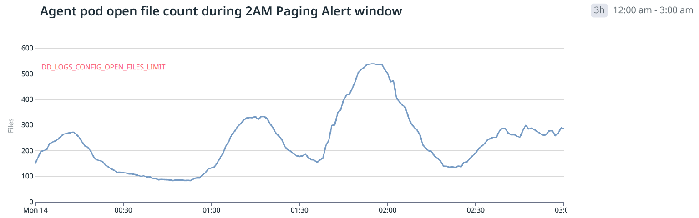
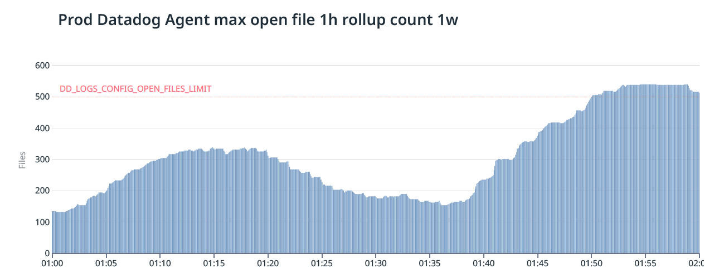

# Open Files Limit

## Notebook

### Markdown Widget

- Configured imit is 2,000 parallel tailed logs per agent.
  - The maximum number of files that can be tailed in parallel https://docs.datadoghq.com/agent/logs/?tab=tailfiles
  - <repo>/charts/datadog/values.yaml#L40-L42
        ```yaml
        env:
          - name: DD_LOGS_CONFIG_OPEN_FILES_LIMIT
            value: '2000'
        ```
- Identifying highest instant volume sources will be helpful in reducing the immediate impact
  - NOTE: Adjust focus to number of FILES across all agents sharing that open file limit, NOT the individual logfile message volume.

`pod_name: datadog-agent-x8sr9`

## Timeseries Widgets

### Line chart

- `pod_name:datadog* instance:<customer>* $pod_name`
  - `TAGS IN exclude_null(cardinality:@filename[])`

#### `<Customer> Agent pod open file count during 2AM Paging Alert window

- DD_LOGS_CONFIG_OPEN_FILES_LIMIT actual threshold on these pods is 500



#### `<Customer>` Prod Datadog Agent max open file 1h rollup count 1w



### Bar chart

- `pod_name:datadog* -cloud_provider:gcp tail* -instance:prod-x`
  - `TAGS IN cutoff_max(exclude_null(cardinality:@filename[]`
- Count by instance over "source:oom_kill $service"

## Dashboard: Datadog Agent Open Files

### Dashboard Timeseries Widgets

- Line chart
  - Agent pod open file count during 2AM Paging Alert window
  - Prod Top 5 datadog agents by max open file count
  - Agent pod CPU Requests, Limits and...
- Bar Chart
  - Prod Datadog Agent max open file count 4h rollup past 4w
  - Max File Limit by instance
