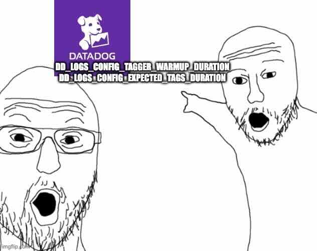

# Datadog Agent Startup Investigation

## Notebook

- Spike in alerts may be handled with env vars
  - [`DD_CLUSTER_CHECKS_WARMUP_DURATION`](https://docs.datadoghq.com/containers/cluster_agent/commands/?tab=helm#cluster-agent-environment-variables)
- ENV vars to address missing metrics on Agent pod startup
  - [`DD_LOGS_CONFIG_TAGGER_WARMUP_DURATION`](https://docs.datadoghq.com/containers/kubernetes/log/?tab=helm#missing-tags-on-new-containers-or-pods)
  - [`DD_LOGS_CONFIG_EXPECTED_TAGS_DURATION`](https://docs.datadoghq.com/containers/kubernetes/log/?tab=helm#missing-host-level-tags-on-new-hosts-or-nodes)



### Timeseries

- Count `by env` over
      ```datadog
      source:datadog @evt.type:"Agent Startup"
      ```
  - `env in cutoff_max(exclude_null(count[source:datadog @evt.type:"Agent Startup"]), 30)`

### Log Patterns

#### Agent Errors

- Datadog Agent Error Log Patterns, past 3 days
  - Count: 136K, Volume: 15K. @CHECK:redisdb
  - Message: Error running check: [{"message":"Authentication required.","traceback":"
